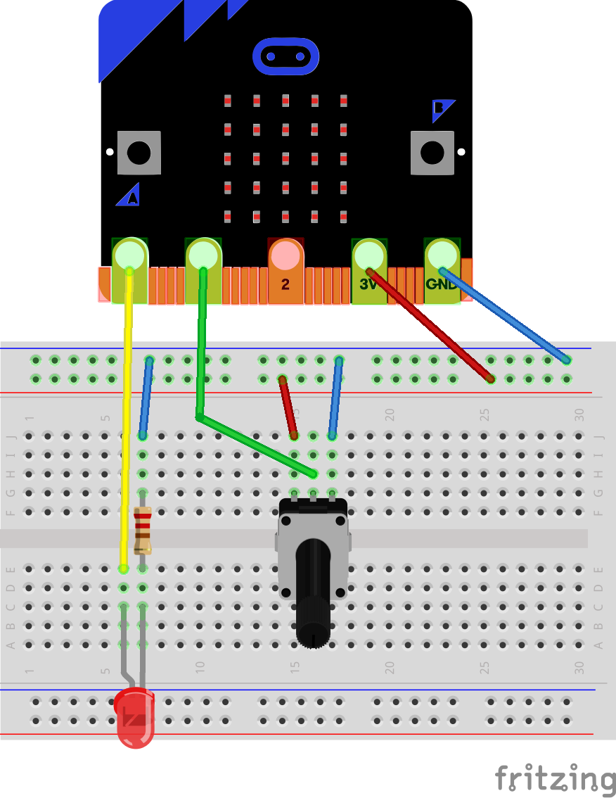

Analog Input Example
====================

In this example we will see how to read the analog value of a pin. This means
reading a value between 0 and 1023 that tells the voltage applied to the pin.
0 means 0 volts 1023 means 3.3 volts.

Wiring Diagram
==============

We start from the same circuit as the [Digital Out](../digital_out) example,
and we add a potentiometer. The center pin of the potentiometer is connected
to pin 1 of the micro:bit the other two pins are respectively connected to
GND and 3V.

Extra hardware:

 - A breadboard
 - An LED
 - A 47k ohm resistor
 - A potentiometer

Wiring:



Code
====

To read the analog value of the IO pin we are going to use the function `Analog`
of the package `MicroBit.IOs`.

```ada
   function Analog (Pin : Pin_Id) return Analog_Value
     with Pre => Supports (Pin, Analog);
   --  Read the voltagle applied to the pin. 0 means 0V 1023 means 3.3V
```

Arguments:

 - Pin : The id of the pin that we want read the analog value

Precondition:

The function `Analog` has a precondition that the pin must support analog IO.

In the code, we are going to write an infinite loop that reads the value of pin
1, and set pin 0 to the same value.

This means that you can control the brightness of the LED using the 
potentiometer.

Here is the code:
```ada
with MicroBit.IOs;

procedure Main is

   Value : MicroBit.IOs.Analog_Value;
begin

   --  Loop forever
   loop

      --  Read analog value of pin
      Value := MicroBit.IOs.Analog (1);

      --  Write analog value of pin 0
      MicroBit.IOs.Write (0, Value);
   end loop;
end Main;
```
