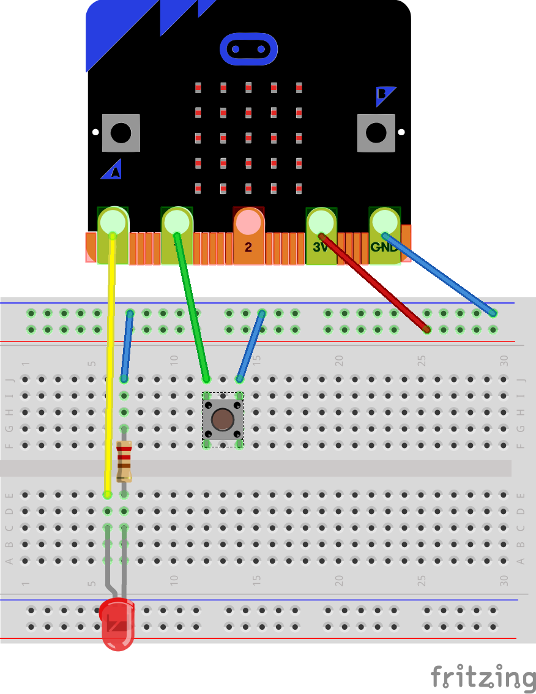

Digital Input Example
=====================

In this example we will see how to read the digital state of a pin. This means
reading if the pin is at 0 volts (low) or 3.3 volts (high).

Wiring Diagram
==============

We start from the same circuit as the [Digital Out](../digital_out) example,
and we add a push button.

Extra hardware:

 - A breadboard
 - An LED
 - A 470 ohm resistor
 - A push button

Wiring:



Code
====

To read the state of the IO pin we are going to use the function `Set` of the 
package `MicroBit.IOs`.

```ada
   function Set (Pin : Pin_Id) return Boolean
     with Pre => Supports (Pin, Digital);
```

Arguments:

 - Pin   : The id of the pin that we want to read as digital input

Precondition:

The procedure `Set` has a precondition that the pin must support digital IO.

As you can see, the function `Set` to read the pin has the same name as the
procedure `set` that we used to control the pin in the
[Digital Out](../Digital_out) example. It is called overloading, two subprograms
with the same name that provide different services.

In the code, we are going to write an infinite loop that reads the state of pin
`1`. If it is high, it means the button is not pressed so we turn off the LED on
pin `0`. It if it is low, it means the button is pressed so we turn on the LED on
pin `0`.

Here is the code:
```ada
with MicroBit.IOs;

procedure Main is
begin

   --  Loop forever
   loop

      --  Check if pin 1 is high
      if MicroBit.IOs.Set (1) then

         --  Turn off the LED connected to pin 0
         MicroBit.IOs.Set (0, False);
      else

         --  Turn on the LED connected to pin 0
         MicroBit.IOs.Set (0, True);
      end if;
   end loop;
end Main;
```
