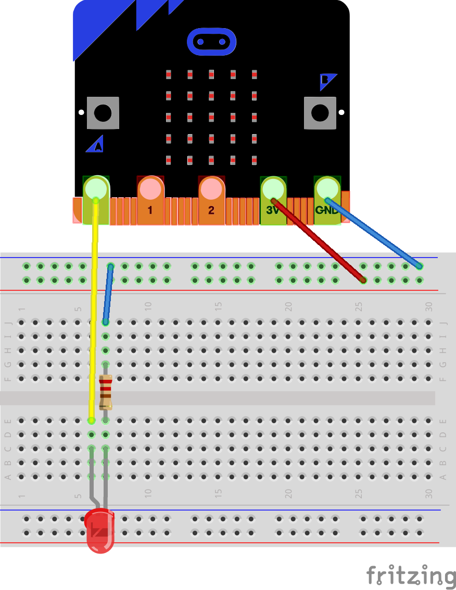

Digital Output Example
======================

In this example we will see how to control a pin as digital output by flashing
an external LED. This means that the voltage on the pin connected to the LED 
will be either 0 volts or 3.3 volts.

Wiring Diagram
==============

Wiring the LED directly from the output pin to ground will make it burn, so we 
have to add a resistor to limit the flow of current.

Extra hardware:

 - A breadboard
 - An LED
 - A 470 ohm resistor

Wiring:



Code
====

To control the IO pin we are going to use the procedure `Set` of the package
`MicroBit.IOs`.

```ada
   procedure Set (Pin : Pin_Id; Value : Boolean)
     with Pre => Supports (Pin, Digital);
```

Arguments:

 - Pin   : The id of the pin that we want to control as digital output
 - Value : A boolean that says if we want the pin to be high (True) or low
   (False)

Precondition:

The procedure `Set` has a precondition that the pin must support digital IO.

We also use the procedure `Delay_Ms` of the package `MicroBit.Time` to stop the
program for a short amount of time.

Here is the code:
```ada
with MicroBit.IOs;
with MicroBit.Time;

procedure Main is
begin

   --  Loop forever
   loop
      --  Turn on the LED connected to pin 0
      MicroBit.IOs.Set (0, True);

      --  Wait 500 milliseconds
      MicroBit.Time.Delay_Ms (500);

      --  Turn off the LED connected to pin 0
      MicroBit.IOs.Set (0, False);

      --  Wait 500 milliseconds
      MicroBit.Time.Delay_Ms (500);
   end loop;
end Main;
```
