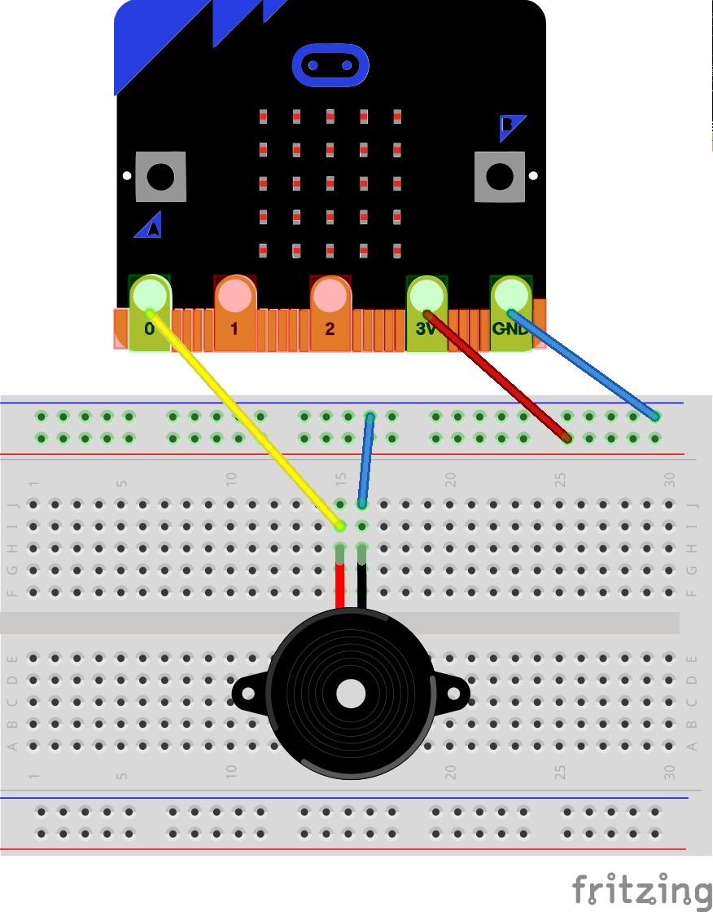

Music Example
=============

In this example we will see how to play some simple music with the micro:bit
and a piezo buzzer.

In the [Analog Out](../analog_out) we said that the analog output was actually a
Pulse Width Modulation (PWM) signal. When a piezo buzzer is connected to a PWM
a note is produced, changing the frequency of the PWM signal means changing the 
note that the buzzer will play.

Wiring Diagram
==============

For this example we simply connect a piezo buzzer to pin 0 and ground.

Extra hardware:

 - A breadboard
 - A piezo buzzer

Wiring:



Code
====

The package `MicroBit.Music` provides different ways to play music. We are going
to use the procedure that plays a melody. A `Melody` is an array of `Note`,
each `Note` is made of a pitch and a duration in milliseconds. This package
also provides declaration of pitches for the chromatic scale (e.g `C4`, `GS5`).

So we declare our little melody like so:

```ada
   My_Little_Melody : constant MicroBit.Music.Melody :=
     ((C4,   400),
      (G3,   800),
      (B3,   400),
      (Rest, 400),
      (A3,   400),
      (G3,   400));
```

The melody is constant because we are not going to change it during the
execution of the program.

Then we simply have to call the procedure `Play` of the package 
`MicroBit.Music`.

```ada
   procedure Play (Pin : Pin_Id; M : Melody)
     with Pre => Supports (Pin, Analog);
```

Arguments:

 - Pin   : The id of the pin that the melody will play on
 - M     : The melody that we want to play

Precondition:

The procedure `Play` has a precondition that the pin must support analog IO.

Here is the code:
```ada
with MicroBit.Music; use MicroBit.Music;

procedure Main is

   My_Little_Melody : constant MicroBit.Music.Melody :=
     ((C4,   400),
      (G3,   800),
      (B3,   400),
      (Rest, 400),
      (A3,   400),
      (G3,   400));
begin

   --  Loop forever
   loop

      --  Play the little melody on pin 0
      MicroBit.Music.Play (0, My_Little_Melody);
   end loop;
end Main;
```
